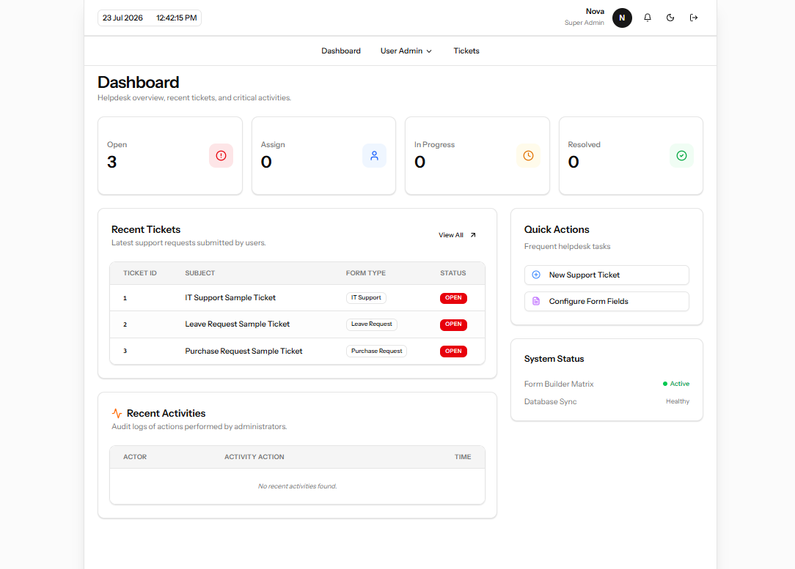
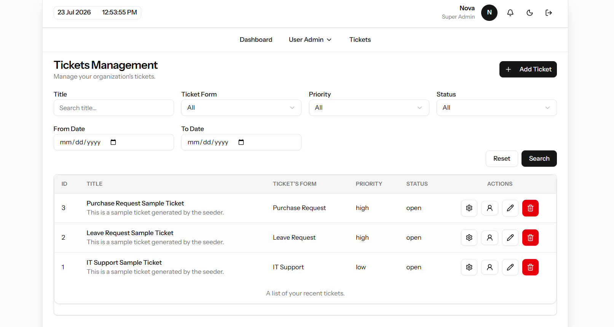
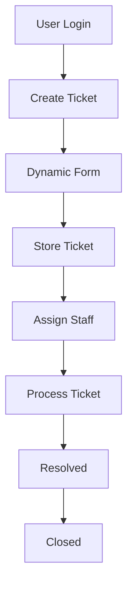

# Help Desk Reporting System

> A modern Help Desk Reporting System built with Laravel, React, Inertia.js, Tailwind CSS, and MySQL.

---

## 📌 Table of Contents

- Overview
- Features
- Screenshots
- Demo
- Tech Stack
- System Architecture
- Project Flow
- Database Design
- Roles & Permissions
- Installation
- Environment Configuration
- Running the Project
- Folder Structure
- Project Modules
- API (Optional)
- Reports
- Future Roadmap
- Contributing
- License
- Author

---

# 📖 Overview

Project introduction...

---

# ✨ Features

## Authentication

- Login
- Register
- Forgot Password
- Role & Permission

## Ticket Management

- Create Ticket
- Update Ticket
- Assign Ticket
- Priority
- Status

## Dynamic Form Builder

- Text
- Textarea
- Select
- Checkbox
- Radio
- Date
- File Upload

## Comments

- Staff Comments
- User Comments

## Notifications

- Email
- In-App

## Reports

- Dashboard
- Ticket Statistics

---

# 📷 Screenshots

### Dashboard



### Ticket List



### Ticket Detail


---

# 🎥 Demo

Live Demo

```
https://example.com
```

---

# 🛠 Tech Stack

| Technology | Version |
|------------|----------|
| Laravel | 12 |
| React | 19 |
| Inertia.js | Latest |
| TailwindCSS | 4 |
| MySQL | 8 |
| Spatie Permission | Latest |

---

# 🏗 System Architecture

```text
React
      │
Inertia.js
      │
Laravel
      │
MySQL
```

---

# 🔄 Project Flow



---

# 📂 Database Design

## Main Tables

- users
- roles
- permissions
- tickets
- ticket_histories
- ticket_forms
- ticket_form_fields
- ticket_answers
- activity_log

---

# 👥 Roles & Permissions

| Role | Description |
|------|-------------|
| Admin | Full System Access |
| Staff | Manage Assigned Tickets |
| User | Create & View Tickets |

---

# 🚀 Installation

## Clone Repository

```bash
git clone https://github.com/username/helpdesk-reporting-system.git
```

## Enter Project

```bash
cd helpdesk-reporting-system
```

## Install Backend

```bash
composer install
```

## Install Frontend

```bash
npm install
```

## Copy Environment

```bash
cp .env.example .env
```

## Generate Key

```bash
php artisan key:generate
```

## Configure Database

```env
DB_DATABASE=helpdesk
DB_USERNAME=root
DB_PASSWORD=
```

## Run Migration

```bash
php artisan migrate --seed
```

## Create Storage Link

```bash
php artisan storage:link
```

## Start Backend

```bash
php artisan serve
```

## Start Frontend

```bash
npm run dev
```

---

# ⚙ Environment Configuration

```env
APP_NAME=HelpDesk
APP_URL=http://127.0.0.1:8000
```

---

# 📦 Project Modules

## Authentication

- Login
- Register
- Forgot Password

## Authorization

- CRUD Roles
- Assign permissions for each role
- Dynamic roles and permissions

## Ticket

- CRUD
- Assignment
- Workflow
- Priority
- Status

## Dynamic Form

- Builder
- Validation
- Rendering

## Notifications

- Email
- Database

## Reports

- Dashboard
- Statistics

---

# 📊 Dashboard

- Total Tickets
- Open Tickets
- Pending Tickets
- Resolved Tickets
- Closed Tickets

---

# 📈 Reports

- Tickets by Status
- Tickets by Priority
- Tickets by Staff
- Monthly Reports

---

# 🛣 Roadmap

## Phase 1

- Authentication
- Ticket CRUD

## Phase 2

- Dynamic Form Builder
- File Upload

## Phase 3

- Workflow
- Notifications

## Phase 4 ( Upcoming )

- SLA
- Analytics
- Export Excel
- Export PDF

---

# 📄 License

MIT License

---

# 👨‍💻 Author

**Kyaw Zin Soe**

GitHub

https://github.com/kyawzinsoedev
